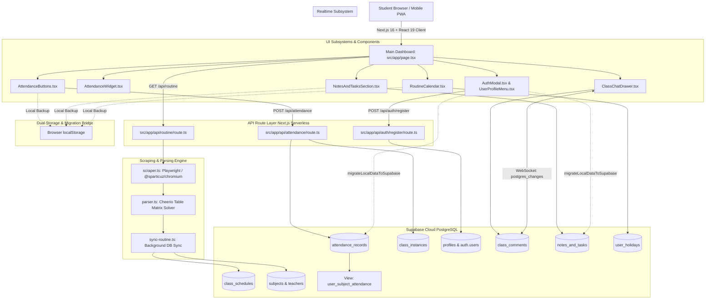
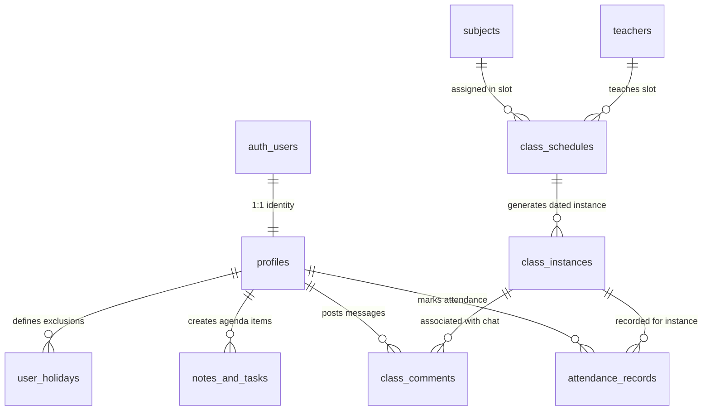
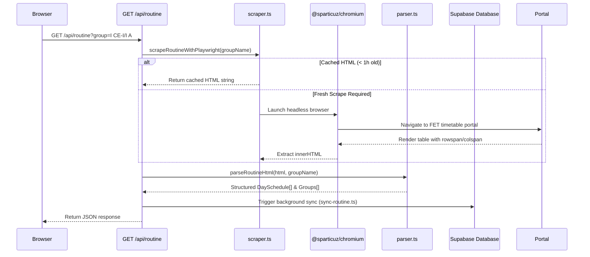
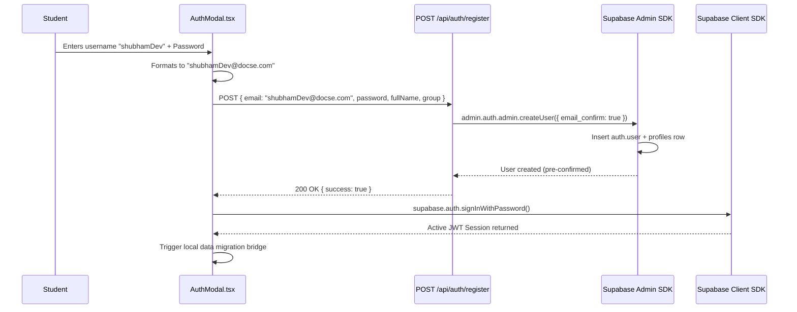

# DOCSE Routine Gate — Complete Architecture & System Documentation

> **Comprehensive Technical Specification, Database Architecture, Application Lifecycle, Scraping Engine, Real-time Subsystems, and Troubleshooting Guide.**

---

## Table of Contents
1. [Executive Summary & Purpose](#1-executive-summary--purpose)
2. [High-Level System Architecture](#2-high-level-system-architecture)
3. [Technology Stack & Key Dependencies](#3-technology-stack--key-dependencies)
4. [Database Architecture & Schema Analysis](#4-database-architecture--schema-analysis)
   - [Entity Relationship Diagram (ERD)](#entity-relationship-diagram-erd)
   - [Core Tables & Schema Definitions](#core-tables--schema-definitions)
   - [80% Attendance Mathematics & Analytical SQL View](#80-attendance-mathematics--analytical-sql-view)
   - [Row Level Security (RLS) & Permission Model](#row-level-security-rls--permission-model)
5. [End-to-End Subsystem Mechanics](#5-end-to-end-subsystem-mechanics)
   - [A. Routine Scraping, Table Parsing & Background Sync](#a-routine-scraping-table-parsing--background-sync)
   - [B. Authentication, Zero-Email Registration & Identity Pipeline](#b-authentication-zero-email-registration--identity-pipeline)
   - [C. Attendance Synchronization & Dynamic Instance Resolution](#c-attendance-synchronization--dynamic-instance-resolution)
   - [D. Offline-First Storage Strategy & Cloud Migration Bridge](#d-offline-first-storage-strategy--cloud-migration-bridge)
   - [E. Realtime Class Discussion & Comments Engine](#e-realtime-class-discussion--comments-engine)
   - [F. Academic Planner (Tasks, Assignments, Lab Reminders & Notes)](#f-academic-planner-tasks-assignments-lab-reminders--notes)
   - [G. Interactive Calendar & Holiday/Exclusion System](#g-interactive-calendar--holidayexclusion-system)
6. [Critical Troubleshooting, Edge Cases & Resolved Gotchas](#6-critical-troubleshooting-edge-cases--resolved-gotchas)
   - [1. "Saved locally only (cloud sync failed)" / UUID Mismatch](#1-saved-locally-only-cloud-sync-failed--uuid-mismatch)
   - [2. Supabase Free Tier "Email rate limit exceeded" (3/hr Limit)](#2-supabase-free-tier-email-rate-limit-exceeded-3hr-limit)
   - [3. Supabase GoTrue `.student` TLD Rejection](#3-supabase-gotrue-student-tld-rejection)
   - [4. Vercel Build-Time `NEXT_PUBLIC_*` Inlining & Local Session Fallback](#4-vercel-build-time-next_public_-inlining--local-session-fallback)
   - [5. Serverless Chromium Headless Execution on Vercel / AWS Lambda](#5-serverless-chromium-headless-execution-on-vercel--aws-lambda)
7. [Developer Setup, Deployment & Maintenance Guide](#7-developer-setup-deployment--maintenance-guide)
   - [Environment Variables Checklist](#environment-variables-checklist)
   - [Complete SQL Database Setup Script](#complete-sql-database-setup-script)
   - [Local Development & Build Instructions](#local-development--build-instructions)
   - [File Map & Codebase Hierarchy](#file-map--codebase-hierarchy)

---

## 1. Executive Summary & Purpose

### Why this System Exists
**DOCSE Routine Gate** is a specialized academic schedule hub and student productivity system built for university students in the **Department of Computer Science & Engineering (DOCSE)** at Kathmandu University.

#### Core Problems Solved:
1. **Fragmented & Hard-to-Read Schedules**: University routines are traditionally published as complex HTML tables or static PDF matrices across departmental portals. The system dynamically scrapes and parses these schedules into an intuitive, real-time schedule view highlighting active ongoing classes, upcoming lectures, assigned rooms, and faculty details.
2. **Strict 80% Attendance Threshold Requirement**: Engineering programs mandate an 80% minimum attendance threshold to be eligible for semester board examinations. Students often lose track of their live standing. The application calculates real-time attendance health, computing:
   - **Safe Skip Buffer**: Exactly how many future classes the student can skip while remaining at or above 80%.
   - **Catch-Up Requirement**: Exactly how many consecutive classes the student must attend to recover from an attendance deficit.
3. **Cross-Device Continuity & Classroom Convenience**: Students mark attendance or review notes on mobile devices in classrooms, and later manage assignments on laptops at home.
4. **Offline-First & Transparent Cloud Migration**: Students without an account or with spotty classroom internet can use the entire system immediately in guest offline mode. When they create an account, their stored records migrate seamlessly to the cloud.
5. **Real-time In-Class Discussion**: Classmates can chat, ask questions, and share notes per class instance or group in real-time.

---

## 2. High-Level System Architecture



---

## 3. Technology Stack & Key Dependencies

| Layer / Subsystem | Technology | Version | Purpose |
| :--- | :--- | :--- | :--- |
| **Framework** | Next.js (App Router) | `16.3.5` | React Server Components, API routes, optimized static/dynamic rendering |
| **UI Library** | React & React DOM | `19.2.8` | Component rendering, hooks, optimistic state management |
| **Styling** | Tailwind CSS & PostCSS | `v4.x` | Modern utility styling with CSS variables and responsive design |
| **Typography** | `next/font` (Geist & Geist Mono) | Bundled | Clean, high-legibility modern monospace and sans typography |
| **Icons** | Lucide React | `^1.47.0` | Comprehensive lightweight SVG icons |
| **Cloud Database** | Supabase (PostgreSQL) | `@supabase/supabase-js ^2.116.0` | Relational tables, RLS security, analytical SQL views |
| **Auth & Realtime** | Supabase Auth & Realtime | `@supabase/ssr ^0.12.7` | Zero-email admin registration, session tokens, WebSocket chat subscriptions |
| **Headless Browser** | Playwright Core | `^1.63.0` | Headless browser automation for routine portal navigation |
| **Serverless Chromium** | `@sparticuz/chromium` | `^153.0.0` | Optimized Chromium binary for Vercel / AWS Lambda environments |
| **HTML Parser** | Cheerio | `^1.2.0` | Fast DOM parsing, merged table cell matrix reconstruction |
| **Language** | TypeScript | `^5.x` | Strict type safety across database types, API contracts, and components |

---

## 4. Database Architecture & Schema Analysis

The database runs on PostgreSQL in Supabase. It uses strict foreign key constraints with cascading deletes, Row Level Security (RLS) policies for user data isolation, and computed views for mathematical calculations.

### Entity Relationship Diagram (ERD)



---

### Core Tables & Schema Definitions

#### 1. `public.profiles`
- **Purpose**: Stores student profiles linked directly to Supabase Authentication (`auth.users`).
- **Columns**:
  - `id (UUID, PK)`: Foreign key referencing `auth.users(id) ON DELETE CASCADE`.
  - `full_name (TEXT)`: Student display name.
  - `academic_group (TEXT)`: Student section/group (e.g., `"I CE-I/I A"`).
  - `course (TEXT)`: Enrolled program (e.g., `"B.E. Computer Engineering"`).
  - `created_at (TIMESTAMPTZ)`: Creation timestamp.
  - `updated_at (TIMESTAMPTZ)`: Last update timestamp.

#### 2. `public.subjects` & `public.teachers`
- **Purpose**: Master directories populated automatically during routine scraping and background sync.
- **Columns**:
  - `public.subjects`: `id (UUID, PK)`, `name (TEXT UNIQUE)`, `code (TEXT)`, `created_at (TIMESTAMPTZ)`.
  - `public.teachers`: `id (UUID, PK)`, `name (TEXT UNIQUE)`, `department (TEXT)`, `created_at (TIMESTAMPTZ)`.

#### 3. `public.class_schedules`
- **Purpose**: Recurring weekly timetable template slots.
- **Columns**:
  - `id (UUID, PK)`: Primary key.
  - `academic_group (TEXT)`: Target class section (e.g., `"I CE-I/I A"`).
  - `day_of_week (TEXT)`: Day tag (`"Mon"`, `"Tue"`, `"Wed"`, `"Thu"`, `"Fri"`, `"Sun"`, `"Sat"`).
  - `start_time (TEXT)`: Class start time (e.g., `"09:00"`).
  - `end_time (TEXT)`: Class end time (e.g., `"11:00"`).
  - `room (TEXT)`: Room or lab code (e.g., `"9-302"`, `"Computer Lab"`).
  - `subject_id (UUID, FK)`: References `subjects(id)`.
  - `subject_name (TEXT)`: Cached subject name for fast lookups.
  - `teacher_id (UUID, FK)`: References `teachers(id)`.
  - `teacher_name (TEXT)`: Cached teacher name.
  - `colspan (INT)`: Slot duration in hours (e.g., `1`, `2`, or `3`).
- **Constraint**: `UNIQUE (academic_group, day_of_week, start_time, room)` ensures idempotent upserts during background routine scraping.

#### 4. `public.class_instances`
- **Purpose**: Represents a concrete calendar date occurrence of a scheduled class slot.
- **Columns**:
  - `id (UUID, PK)`: Primary key.
  - `schedule_id (UUID, FK)`: References `class_schedules(id) ON DELETE CASCADE`.
  - `class_date (DATE)`: Concrete calendar date (`YYYY-MM-DD`).
  - `status (TEXT)`: `'scheduled'`, `'cancelled'`, or `'completed'`.
  - `created_at (TIMESTAMPTZ)`: Creation timestamp.
- **Constraint**: `UNIQUE (schedule_id, class_date)` prevents duplicate instances for the same class on the same day.

#### 5. `public.attendance_records`
- **Purpose**: Individual attendance marks per student per class instance.
- **Columns**:
  - `id (UUID, PK)`: Primary key.
  - `user_id (UUID, FK)`: References `public.profiles(id) ON DELETE CASCADE`.
  - `class_instance_id (UUID, FK)`: References `public.class_instances(id) ON DELETE CASCADE`.
  - `status (TEXT)`: Constrained to `'present'`, `'absent'`, or `'excused'`.
  - `created_at (TIMESTAMPTZ)`: Mark creation timestamp.
  - `updated_at (TIMESTAMPTZ)`: Last modification timestamp.
- **Constraint**: `UNIQUE (user_id, class_instance_id)` guarantees one status per user per class instance.

#### 6. `public.class_comments`
- **Purpose**: Real-time per-class chat and discussions between classmates.
- **Columns**:
  - `id (UUID, PK)`: Primary key.
  - `schedule_id (UUID, FK)`: Optional reference to `class_schedules(id)`.
  - `class_instance_id (UUID, FK)`: Optional reference to `class_instances(id)`.
  - `academic_group (TEXT)`: Classroom group tag.
  - `user_id (UUID, FK)`: References `public.profiles(id)`.
  - `user_name (TEXT)`: Cached display name.
  - `message (TEXT)`: Comment content.
  - `created_at (TIMESTAMPTZ)`: Message timestamp.

#### 7. `public.notes_and_tasks`
- **Purpose**: Academic agenda for assignments, reminders, items to bring to lab, and study notes.
- **Columns**:
  - `id (UUID, PK)`: Primary key.
  - `user_id (UUID, FK)`: References `public.profiles(id) ON DELETE CASCADE`.
  - `academic_group (TEXT)`: Associated group section.
  - `subject_id (UUID, FK)`: Optional reference to `subjects(id)`.
  - `subject_name (TEXT)`: Subject tag.
  - `title (TEXT)`: Task title.
  - `description (TEXT)`: Optional detailed notes.
  - `type (TEXT)`: Constrained to `'reminder'`, `'assignment'`, `'bring_item'`, `'note'`.
  - `due_date (TIMESTAMPTZ)`: Optional deadline.
  - `is_completed (BOOLEAN)`: Completion status flag.
  - `created_at (TIMESTAMPTZ)` / `updated_at (TIMESTAMPTZ)`.

#### 8. `public.user_holidays`
- **Purpose**: User-specific or group-specific holiday / vacation exclusions.
- **Columns**:
  - `id (UUID, PK)`: Primary key.
  - `user_id (UUID, FK)`: References `public.profiles(id) ON DELETE CASCADE`.
  - `holiday_date (DATE)`: Excluded date (`YYYY-MM-DD`).
  - `academic_group (TEXT)`: Associated group section.
  - `title (TEXT)`: Optional name for holiday.
  - `created_at (TIMESTAMPTZ)`.

---

### 80% Attendance Mathematics & Analytical SQL View

The system uses a mathematical model to calculate the exact skip buffer or catch-up requirement for any student standing.

```sql
CREATE OR REPLACE VIEW public.user_subject_attendance
WITH (security_invoker = true) AS
SELECT 
  a.user_id,
  COALESCE(s.name, cs.subject_name, 'General') AS subject_name,
  COUNT(a.id) AS total_classes,
  COUNT(CASE WHEN a.status = 'present' THEN 1 END) AS attended_classes,
  COUNT(CASE WHEN a.status = 'absent' THEN 1 END) AS absent_classes,
  COUNT(CASE WHEN a.status = 'excused' THEN 1 END) AS excused_classes,
  ROUND(
    (COUNT(CASE WHEN a.status = 'present' THEN 1 END)::NUMERIC / NULLIF(COUNT(a.id), 0)) * 100, 1
  ) AS attendance_percentage,
  
  -- Formula 1: Classes you can safely skip while maintaining >= 80%
  FLOOR(
    GREATEST(0, (COUNT(CASE WHEN a.status = 'present' THEN 1 END) - 0.80 * COUNT(a.id)) / 0.80)
  ) AS classes_can_skip,
  
  -- Formula 2: Consecutive classes needed to attend to reach 80%
  CEIL(
    GREATEST(0, (0.80 * COUNT(a.id) - COUNT(CASE WHEN a.status = 'present' THEN 1 END)) / 0.20)
  ) AS classes_needed_to_catchup
FROM public.attendance_records a
JOIN public.class_instances ci ON a.class_instance_id = ci.id
JOIN public.class_schedules cs ON ci.schedule_id = cs.id
LEFT JOIN public.subjects s ON cs.subject_id = s.id
GROUP BY a.user_id, COALESCE(s.name, cs.subject_name, 'General');
```

#### Mathematical Proofs

Let:
- $P = \text{Attended (Present) classes}$
- $T = \text{Total recorded classes}$
- $\text{Threshold} = 0.80$ (80%)

##### 1. Classes You Can Skip ($S$)
If a student skips $S$ consecutive upcoming classes, total classes will increase to $T + S$, while present count stays at $P$.
$$\frac{P}{T + S} \ge 0.80 \implies P \ge 0.80(T + S) \implies P - 0.80T \ge 0.80S \implies S \le \frac{P - 0.80T}{0.80} = \frac{P}{0.80} - T$$
Therefore:
$$S = \max\left(0, \left\lfloor \frac{P - 0.80T}{0.80} \right\rfloor\right)$$

##### 2. Classes Needed to Catch Up ($C$)
If a student is below 80% and attends $C$ consecutive future classes, total classes becomes $T + C$, and present count becomes $P + C$.
$$\frac{P + C}{T + C} \ge 0.80 \implies P + C \ge 0.80T + 0.80C \implies 0.20C \ge 0.80T - P \implies C \ge \frac{0.80T - P}{0.20}$$
Therefore:
$$C = \max\left(0, \left\lceil \frac{0.80T - P}{0.20} \right\rceil\right)$$

---

### Row Level Security (RLS) & Permission Model

1. **Analytical View Security (`WITH (security_invoker = true)`)**:
   - Ensures the view respects the querying user's RLS permissions so students can only inspect their own attendance data.
2. **Private User Tables**:
   - `profiles`, `attendance_records`, `notes_and_tasks`, and `user_holidays` enforce `auth.uid() = user_id` (or `auth.uid() = id`).
3. **Public Read Schedules**:
   - `class_schedules`, `subjects`, `teachers`, and `class_instances` allow public `SELECT` access, allowing unauthenticated guests to view routine timetables.
4. **Realtime Chat Isolation**:
   - `class_comments` allows authenticated users to `INSERT` and read messages associated with their group or class instance.

---

## 5. End-to-End Subsystem Mechanics

### A. Routine Scraping, Table Parsing & Background Sync



1. **Scraping Pipeline (`src/lib/scraper.ts`)**:
   - Uses **Playwright Core** with `@sparticuz/chromium` on production (Vercel serverless) and native Chrome locally.
   - Automatically navigates to the timetable portal (`https://docse.netlify.app`), clicks through the group selection layout, and extracts fully rendered HTML tables.
   - Includes an in-memory 1-hour TTL cache to avoid spawning headless browser instances on every single HTTP request.
2. **Cheerio Table Matrix Parser (`src/lib/parser.ts`)**:
   - Solves the complex 2D table grid containing merged columns (`colspan`) and merged rows (`rowspan`).
   - Normalizes time headers (e.g. `09:00 - 10:00`, `10:00 - 11:00`), room assignments, teacher tags, and course codes.
3. **Asynchronous Background Sync (`src/lib/supabase/sync-routine.ts`)**:
   - Extracts unique subjects, teachers, and timetable slots and performs idempotent upserts to Supabase tables (`subjects`, `teachers`, `class_schedules`) using the service role admin client.

---

### B. Authentication, Zero-Email Registration & Identity Pipeline

To solve the Supabase free-tier 3 emails/hour rate limit and allow students to use simple usernames, the application uses a zero-email server-side onboarding pipeline:



1. **Flexible Username Normalization**:
   - Students can register with either a plain username (`shubhamDev`) or a real email (`shubham@gmail.com`).
   - Plain usernames are automatically normalized to `${sanitizedUsername}@docse.com` (using standard `.com` TLD to pass Supabase GoTrue validators).
2. **Server-Side Pre-Confirmed Registration (`/api/auth/register`)**:
   - Uses `SUPABASE_SERVICE_ROLE_KEY` to call `supabase.auth.admin.createUser()` with `email_confirm: true`.
   - Bypasses external email dispatchers completely, eliminating `over_email_send_rate_limit` errors.
3. **Anonymous Guest Mode**:
   - Allows students to browse, customize schedules, mark attendance, and take notes locally without signing up.

---

### C. Attendance Synchronization & Dynamic Instance Resolution

When a student clicks `Present`, `Absent`, or `Excused` in [AttendanceButtons.tsx](file:///d:/Using/Project/routine/src/components/attendance/AttendanceButtons.tsx):

1. **Optimistic UI Update**: The button state highlights immediately without UI blocking.
2. **Local Backup**: The mark is written to `localStorage` under `docse_att_<userId>`.
3. **Cloud Dispatch (`POST /api/attendance`)**:
   - The client passes `{ userId, academicGroup, dayOfWeek, startTime, room, classDate, subjectName, status, classInstanceId }`.
4. **Server-Side Instance Resolution**:
   - If `classInstanceId` is not already a valid database UUID, the server automatically queries `class_schedules` to find or create the schedule slot, then queries `class_instances` to ensure the concrete date instance exists.
   - It records the attendance mark in `attendance_records` using an upsert with `ON CONFLICT (user_id, class_instance_id)`.
5. **Real-time Attendance Dashboard Update**: The analytical view recalculates stats, updating the [AttendanceWidget.tsx](file:///d:/Using/Project/routine/src/components/attendance/AttendanceWidget.tsx) badge and health meters.

---

### D. Offline-First Storage Strategy & Cloud Migration Bridge

The system supports offline usage and migrates guest data to the cloud upon registration:

| Data Type | Offline / Guest Key | Authenticated Cloud Table |
| :--- | :--- | :--- |
| **Attendance Marks** | `localStorage["docse_att_guest"]` | `public.attendance_records` |
| **Notes & Tasks** | `localStorage["docse_tasks_guest"]` | `public.notes_and_tasks` |
| **Holiday Exclusions** | `localStorage["docse_holidays_guest"]` | `public.user_holidays` |
| **Class Comments** | `localStorage["docse_chat_<slotKey>"]` | `public.class_comments` |

#### Migration Bridge Workflow (`src/lib/migrate-local-data.ts`):
1. Runs automatically whenever a guest registers or signs in to a real Supabase account.
2. Reads all guest attendance records, resolves the database instance UUIDs, and writes batch records under the new user's UUID.
3. Reads guest notes/tasks, inserts them into `public.notes_and_tasks`, and verifies write success.
4. Cleans up local guest keys only upon confirmed cloud synchronization to prevent data loss.

---

### E. Realtime Class Discussion & Comments Engine

[ClassChatDrawer.tsx](file:///d:/Using/Project/routine/src/components/chat/ClassChatDrawer.tsx) provides a real-time discussion drawer for every lecture slot:
1. **Live Subscriptions**: Connects to Supabase Realtime using WebSocket channels:
   ```typescript
   supabase.channel(`room-chat-${scheduleKey}`)
     .on("postgres_changes", { event: "INSERT", schema: "public", table: "class_comments" }, (payload) => {
       // Append new comment to drawer UI in real time
     })
     .subscribe();
   ```
2. **Message Persistence**: Comments are stored in `public.class_comments` with the author's display name and timestamp.
3. **Guest Offline Cache**: Unauthenticated users can view and write local comments saved under `docse_chat_<scheduleKey>`.

---

### F. Academic Planner (Tasks, Assignments, Lab Reminders & Notes)

[NotesAndTasksSection.tsx](file:///d:/Using/Project/routine/src/components/tasks/NotesAndTasksSection.tsx) gives students a centralized academic workspace:
- **4 Categorized Task Types**:
  - `assignment`: Homework and project deadlines.
  - `reminder`: Upcoming tests, quizzes, and class alerts.
  - `bring_item`: Lab equipment, drawing tools, calculators, or notebooks.
  - `note`: Lecture summaries, formula sheets, and study tips.
- **Subject Filtering**: Filter tasks by the currently selected lecture or view all subjects.
- **Completion Tracking**: Check off completed items with visual progress badges.
- **Cloud & Offline Sync**: Dual persistence with Supabase `public.notes_and_tasks` and local fallback.

---

### G. Interactive Calendar & Holiday/Exclusion System

[RoutineCalendar.tsx](file:///d:/Using/Project/routine/src/components/calendar/RoutineCalendar.tsx) and [src/lib/attendance.ts](file:///d:/Using/Project/routine/src/lib/attendance.ts):
- **Full Month Navigation**: Browse any month/year with an instant "Go to Today" jump button.
- **Holiday & Vacation Toggles**: Click any date to mark it as a **Holiday / Excluded Date**.
- **Attendance Exclusion**: All classes falling on excluded dates are automatically omitted from total class counts ($T$) in the attendance formulas, preventing students from being penalized for institutional holidays or cancellations.

---

## 6. Critical Troubleshooting, Edge Cases & Resolved Gotchas

### 1. "Saved locally only (cloud sync failed)" / UUID Mismatch
- **Root Cause**: When attendance was marked before a scraped routine was synced into the database, the client attempted a direct upsert using a placeholder string (e.g. `instance_COMP 102_...`). PostgreSQL rejected the insert with a UUID syntax error or foreign key violation.
- **Resolution**: Routed all attendance writes through `POST /api/attendance`. The server-side route checks if the target instance is a valid UUID; if not, it automatically finds or creates the corresponding `class_schedules` and `class_instances` rows with admin privileges before saving the mark.

---

### 2. Supabase Free Tier "Email rate limit exceeded" (3/hr Limit)
- **Root Cause**: Calling `supabase.auth.signUp()` from the client triggers Supabase's built-in confirmation email service, which is capped at 3 emails per hour on free projects.
- **Resolution**: Created `POST /api/auth/register/route.ts` which utilizes `supabase.auth.admin.createUser({ email_confirm: true })`. This bypasses outgoing confirmation emails completely. Additionally, ensure **"Confirm email"** is turned off in Supabase Dashboard → Authentication → Providers → Email.

---

### 3. Supabase GoTrue `.student` TLD Rejection
- **Root Cause**: Early versions generated mock emails using `@docse.student`. Supabase GoTrue enforces standard RFC Top-Level Domains and rejected `.student` as invalid.
- **Resolution**: In `AuthModal.tsx`, usernames are sanitized and suffixed with `@docse.com`. Genuine email addresses entered by users pass through untouched.

---

### 4. Vercel Build-Time `NEXT_PUBLIC_*` Inlining & Local Session Fallback
- **Root Cause**: Next.js inlines `NEXT_PUBLIC_*` variables into client-side JavaScript bundles at **build time**. If environment variables are added or modified in Vercel settings without triggering a redeployment, client bundles will continue using placeholder values, causing the app to silently fall back to local offline mode.
- **Resolution**:
  1. Set `NEXT_PUBLIC_SUPABASE_URL` and `NEXT_PUBLIC_SUPABASE_ANON_KEY` in Vercel settings.
  2. Set `SUPABASE_SERVICE_ROLE_KEY` in Vercel settings.
  3. Trigger a **Redeploy** (with "Clear build cache" checked) in Vercel.
  4. In the app, click **Sign Out** once to flush old cached offline tokens, then sign in.

---

### 5. Serverless Chromium Headless Execution on Vercel / AWS Lambda
- **Root Cause**: Standard Playwright downloads multi-hundred-megabyte browser binaries that exceed serverless function deployment limits (50MB/250MB).
- **Resolution**: In `scraper.ts`, dynamic environment detection loads `@sparticuz/chromium` when running on Vercel/production, which extracts a lightweight headless Chromium binary specifically designed for AWS Lambda/Vercel serverless environments.

---

## 7. Developer Setup, Deployment & Maintenance Guide

### Environment Variables Checklist

Create a `.env.local` file in the project root:

```env
# -----------------------------------------------------------------------------
# Supabase Public Configuration (Client & Server)
# -----------------------------------------------------------------------------
NEXT_PUBLIC_SUPABASE_URL=https://your-project-id.supabase.co
NEXT_PUBLIC_SUPABASE_ANON_KEY=eyJhbGciOiJIUzI1NiIsInR5cCI6IkpXVCJ9...

# -----------------------------------------------------------------------------
# Supabase Admin Secret (Server-Only: Registration, Sync & Attendance API)
# -----------------------------------------------------------------------------
SUPABASE_SERVICE_ROLE_KEY=eyJhbGciOiJIUzI1NiIsInR5cCI6IkpXVCJ9...
```

---

### Complete SQL Database Setup Script

Run the following SQL in your **Supabase SQL Editor** to initialize the complete database schema, indexes, RLS policies, and analytical views:

```sql
-- Enable UUID extension
CREATE EXTENSION IF NOT EXISTS "uuid-ossp";

-- 1. PROFILES TABLE
CREATE TABLE IF NOT EXISTS public.profiles (
  id UUID PRIMARY KEY REFERENCES auth.users(id) ON DELETE CASCADE,
  full_name TEXT,
  academic_group TEXT DEFAULT 'I CE-I/I A',
  course TEXT DEFAULT 'B.E. Computer Engineering',
  created_at TIMESTAMPTZ DEFAULT NOW(),
  updated_at TIMESTAMPTZ DEFAULT NOW()
);

-- 2. SUBJECTS & TEACHERS
CREATE TABLE IF NOT EXISTS public.subjects (
  id UUID PRIMARY KEY DEFAULT uuid_generate_v4(),
  name TEXT UNIQUE NOT NULL,
  code TEXT,
  created_at TIMESTAMPTZ DEFAULT NOW()
);

CREATE TABLE IF NOT EXISTS public.teachers (
  id UUID PRIMARY KEY DEFAULT uuid_generate_v4(),
  name TEXT UNIQUE NOT NULL,
  department TEXT,
  created_at TIMESTAMPTZ DEFAULT NOW()
);

-- 3. CLASS SCHEDULES (Weekly Template)
CREATE TABLE IF NOT EXISTS public.class_schedules (
  id UUID PRIMARY KEY DEFAULT uuid_generate_v4(),
  academic_group TEXT NOT NULL,
  day_of_week TEXT NOT NULL,
  start_time TEXT NOT NULL,
  end_time TEXT NOT NULL,
  room TEXT NOT NULL,
  subject_id UUID REFERENCES public.subjects(id) ON DELETE SET NULL,
  subject_name TEXT,
  teacher_id UUID REFERENCES public.teachers(id) ON DELETE SET NULL,
  teacher_name TEXT,
  colspan INT DEFAULT 1,
  created_at TIMESTAMPTZ DEFAULT NOW(),
  updated_at TIMESTAMPTZ DEFAULT NOW(),
  CONSTRAINT unique_schedule_slot UNIQUE (academic_group, day_of_week, start_time, room)
);

-- 4. CLASS INSTANCES (Calendar Occurrences)
CREATE TABLE IF NOT EXISTS public.class_instances (
  id UUID PRIMARY KEY DEFAULT uuid_generate_v4(),
  schedule_id UUID NOT NULL REFERENCES public.class_schedules(id) ON DELETE CASCADE,
  class_date DATE NOT NULL,
  status TEXT DEFAULT 'scheduled' CHECK (status IN ('scheduled', 'cancelled', 'completed')),
  created_at TIMESTAMPTZ DEFAULT NOW(),
  CONSTRAINT unique_instance_date UNIQUE (schedule_id, class_date)
);

-- 5. ATTENDANCE RECORDS
CREATE TABLE IF NOT EXISTS public.attendance_records (
  id UUID PRIMARY KEY DEFAULT uuid_generate_v4(),
  user_id UUID NOT NULL REFERENCES public.profiles(id) ON DELETE CASCADE,
  class_instance_id UUID NOT NULL REFERENCES public.class_instances(id) ON DELETE CASCADE,
  status TEXT NOT NULL CHECK (status IN ('present', 'absent', 'excused')),
  created_at TIMESTAMPTZ DEFAULT NOW(),
  updated_at TIMESTAMPTZ DEFAULT NOW(),
  CONSTRAINT unique_user_instance_att UNIQUE (user_id, class_instance_id)
);

-- 6. CLASS COMMENTS (Realtime Chat)
CREATE TABLE IF NOT EXISTS public.class_comments (
  id UUID PRIMARY KEY DEFAULT uuid_generate_v4(),
  schedule_id UUID REFERENCES public.class_schedules(id) ON DELETE SET NULL,
  class_instance_id UUID REFERENCES public.class_instances(id) ON DELETE SET NULL,
  academic_group TEXT,
  user_id UUID NOT NULL REFERENCES public.profiles(id) ON DELETE CASCADE,
  user_name TEXT,
  message TEXT NOT NULL,
  created_at TIMESTAMPTZ DEFAULT NOW()
);

-- 7. NOTES & TASKS (Academic Planner)
CREATE TABLE IF NOT EXISTS public.notes_and_tasks (
  id UUID PRIMARY KEY DEFAULT uuid_generate_v4(),
  user_id UUID NOT NULL REFERENCES public.profiles(id) ON DELETE CASCADE,
  academic_group TEXT,
  subject_id UUID REFERENCES public.subjects(id) ON DELETE SET NULL,
  subject_name TEXT,
  title TEXT NOT NULL,
  description TEXT,
  type TEXT NOT NULL CHECK (type IN ('reminder', 'assignment', 'bring_item', 'note')),
  due_date TIMESTAMPTZ,
  is_completed BOOLEAN DEFAULT FALSE,
  created_at TIMESTAMPTZ DEFAULT NOW(),
  updated_at TIMESTAMPTZ DEFAULT NOW()
);

-- 8. USER HOLIDAYS
CREATE TABLE IF NOT EXISTS public.user_holidays (
  id UUID PRIMARY KEY DEFAULT uuid_generate_v4(),
  user_id UUID NOT NULL REFERENCES public.profiles(id) ON DELETE CASCADE,
  holiday_date DATE NOT NULL,
  academic_group TEXT,
  title TEXT,
  created_at TIMESTAMPTZ DEFAULT NOW(),
  CONSTRAINT unique_user_holiday UNIQUE (user_id, holiday_date)
);

-- 9. ANALYTICAL ATTENDANCE VIEW
CREATE OR REPLACE VIEW public.user_subject_attendance
WITH (security_invoker = true) AS
SELECT 
  a.user_id,
  COALESCE(s.name, cs.subject_name, 'General') AS subject_name,
  COUNT(a.id) AS total_classes,
  COUNT(CASE WHEN a.status = 'present' THEN 1 END) AS attended_classes,
  COUNT(CASE WHEN a.status = 'absent' THEN 1 END) AS absent_classes,
  COUNT(CASE WHEN a.status = 'excused' THEN 1 END) AS excused_classes,
  ROUND(
    (COUNT(CASE WHEN a.status = 'present' THEN 1 END)::NUMERIC / NULLIF(COUNT(a.id), 0)) * 100, 1
  ) AS attendance_percentage,
  FLOOR(
    GREATEST(0, (COUNT(CASE WHEN a.status = 'present' THEN 1 END) - 0.80 * COUNT(a.id)) / 0.80)
  ) AS classes_can_skip,
  CEIL(
    GREATEST(0, (0.80 * COUNT(a.id) - COUNT(CASE WHEN a.status = 'present' THEN 1 END)) / 0.20)
  ) AS classes_needed_to_catchup
FROM public.attendance_records a
JOIN public.class_instances ci ON a.class_instance_id = ci.id
JOIN public.class_schedules cs ON ci.schedule_id = cs.id
LEFT JOIN public.subjects s ON cs.subject_id = s.id
GROUP BY a.user_id, COALESCE(s.name, cs.subject_name, 'General');

-- 10. ROW LEVEL SECURITY (RLS) POLICIES
ALTER TABLE public.profiles ENABLE ROW LEVEL SECURITY;
ALTER TABLE public.subjects ENABLE ROW LEVEL SECURITY;
ALTER TABLE public.teachers ENABLE ROW LEVEL SECURITY;
ALTER TABLE public.class_schedules ENABLE ROW LEVEL SECURITY;
ALTER TABLE public.class_instances ENABLE ROW LEVEL SECURITY;
ALTER TABLE public.attendance_records ENABLE ROW LEVEL SECURITY;
ALTER TABLE public.class_comments ENABLE ROW LEVEL SECURITY;
ALTER TABLE public.notes_and_tasks ENABLE ROW LEVEL SECURITY;
ALTER TABLE public.user_holidays ENABLE ROW LEVEL SECURITY;

-- Public read for schedule directory
CREATE POLICY "Allow public read on schedules" ON public.class_schedules FOR SELECT USING (true);
CREATE POLICY "Allow public read on subjects" ON public.subjects FOR SELECT USING (true);
CREATE POLICY "Allow public read on teachers" ON public.teachers FOR SELECT USING (true);
CREATE POLICY "Allow public read on class instances" ON public.class_instances FOR SELECT USING (true);

-- User-isolated policies
CREATE POLICY "Users can manage own profile" ON public.profiles FOR ALL USING (auth.uid() = id);
CREATE POLICY "Users can manage own attendance" ON public.attendance_records FOR ALL USING (auth.uid() = user_id);
CREATE POLICY "Users can manage own tasks" ON public.notes_and_tasks FOR ALL USING (auth.uid() = user_id);
CREATE POLICY "Users can manage own holidays" ON public.user_holidays FOR ALL USING (auth.uid() = user_id);
CREATE POLICY "Users can read class comments" ON public.class_comments FOR SELECT USING (true);
CREATE POLICY "Users can insert comments" ON public.class_comments FOR INSERT WITH CHECK (auth.uid() = user_id);
```

---

### Local Development & Build Instructions

```bash
# 1. Install project dependencies
npm install

# 2. Run the Next.js development server
npm run dev

# 3. Open in browser
# Navigate to http://localhost:3000

# 4. Production build verification
npm run build
```

---

### File Map & Codebase Hierarchy

```
routine/
├── src/
│   ├── app/
│   │   ├── api/
│   │   │   ├── attendance/route.ts      # Attendance mark endpoint & instance auto-resolver
│   │   │   ├── auth/register/route.ts   # Zero-email rate-limit-free registration endpoint
│   │   │   └── routine/route.ts         # Scraper, Cheerio table parser & background DB sync
│   │   ├── globals.css                  # Global Tailwind v4 styles & theme tokens
│   │   ├── layout.tsx                   # Root HTML structure, metadata & Geist font provider
│   │   └── page.tsx                     # Main interactive timetable dashboard & state orchestrator
│   ├── components/
│   │   ├── attendance/
│   │   │   ├── AttendanceButtons.tsx    # Present / Absent / Excused interactive controls
│   │   │   └── AttendanceWidget.tsx     # 80% attendance health meter & skip/catch-up stats
│   │   ├── auth/
│   │   │   ├── AuthModal.tsx            # Login, Registration & Guest access dialog
│   │   │   └── UserProfileMenu.tsx      # Profile badge, classroom switcher & sign-out menu
│   │   ├── calendar/
│   │   │   └── RoutineCalendar.tsx      # Month calendar with date picker & holiday exclusion
│   │   ├── chat/
│   │   │   └── ClassChatDrawer.tsx      # Realtime per-class WebSocket discussion drawer
│   │   └── tasks/
│   │       └── NotesAndTasksSection.tsx # Assignments, reminders, lab items & notes planner
│   ├── lib/
│   │   ├── attendance.ts                # Attendance math, local storage helpers & holiday handlers
│   │   ├── migrate-local-data.ts        # Guest-to-account local data migration bridge
│   │   ├── parser.ts                    # Cheerio HTML timetable matrix solver
│   │   ├── scraper.ts                   # Playwright & @sparticuz/chromium headless scraper
│   │   └── supabase/
│   │       ├── admin.ts                 # Service-role admin client (bypasses RLS)
│   │       ├── client.ts                # Browser Supabase client
│   │       ├── server.ts                # Next.js Server Component Supabase client
│   │       └── sync-routine.ts          # Database synchronizer for scraped routines
│   └── types/
│       └── database.ts                  # TypeScript interfaces for all Supabase entities
├── DOCUMENTATION.md                     # Comprehensive technical documentation
├── README.md                            # Quickstart & project overview
├── package.json                         # Dependencies & npm scripts
└── tsconfig.json                        # TypeScript configuration
```

---
*DOCSE Routine Gate — Kathmandu University Department of Computer Science & Engineering.*
