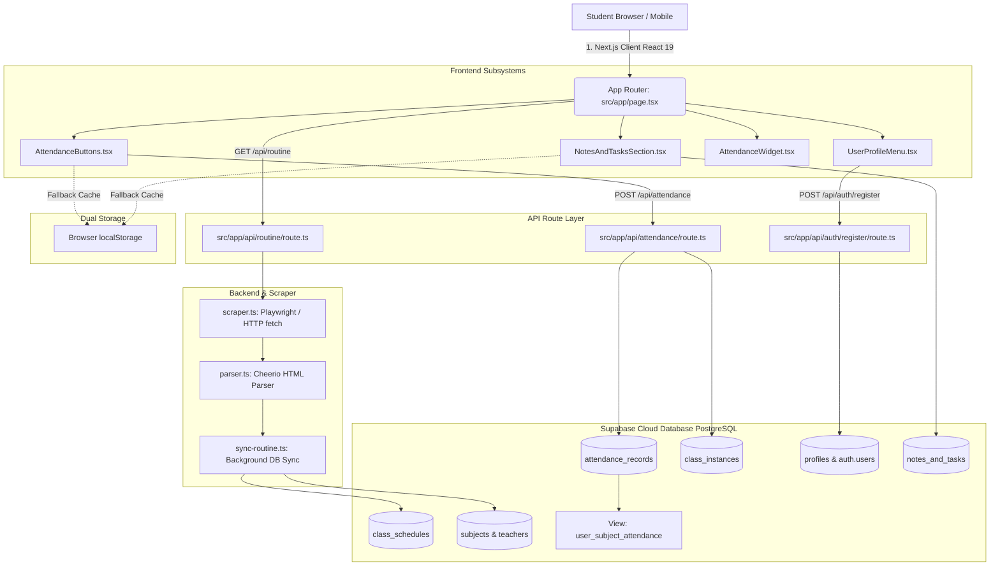

# DOCSE Routine Gate — Complete Architecture & System Documentation

> **Comprehensive Technical Specification, Database Architecture, Application Lifecycle, and Troubleshooting Guide.**

---

## Table of Contents
1. [Executive Summary & Purpose](#1-executive-summary--purpose)
2. [High-Level System Architecture](#2-high-level-system-architecture)
3. [Database Architecture & Schema Analysis](#3-database-architecture--schema-analysis)
   - [Core Tables & Entity Relationships](#core-tables--entity-relationships)
   - [80% Attendance Mathematics & Computed View](#80-attendance-mathematics--computed-view)
   - [Row Level Security (RLS) & Permission Model](#row-level-security-rls--permission-model)
4. [End-to-End Application Mechanics](#4-end-to-end-application-mechanics)
   - [Routine Scraping & Parsing Engine](#a-routine-scraping--parsing-engine)
   - [Authentication & Identity Pipeline](#b-authentication--identity-pipeline)
   - [Hybrid Storage Strategy (Cloud vs. Local Offline)](#c-hybrid-storage-strategy-cloud-vs-local-offline)
   - [Cross-Device Attendance Synchronization](#d-cross-device-attendance-synchronization)
   - [Notes, Tasks & Academic Planner](#e-notes-tasks--academic-planner)
   - [Holiday & Vacation Exclusion Engine](#f-holiday--vacation-exclusion-engine)
5. [Critical Troubleshooting, Edge Cases & Resolved Gotchas](#5-critical-troubleshooting-edge-cases--resolved-gotchas)
   - [1. "Saved locally only (cloud sync failed)"](#1-saved-locally-only-cloud-sync-failed)
   - [2. "Email rate limit exceeded"](#2-email-rate-limit-exceeded)
   - [3. "Email address is invalid" (.student TLD rejection)](#3-email-address-is-invalid-student-tld-rejection)
   - [4. "Guest Account (Local Session)" persistence on Vercel](#4-guest-account-local-session-persistence-on-vercel)
6. [Future Maintenance & Developer Guide](#6-future-maintenance--developer-guide)

---

## 1. Executive Summary & Purpose

### Why this Website Exists
**DOCSE Routine Gate** is an academic management platform designed specifically for university students (e.g., Computer Engineering / DOCSE). 

#### Core Problems Solved:
1. **Scattered, Inaccessible Routines**: Routine schedules are traditionally published as complex HTML tables or static PDFs across departmental portals. The system parses these tables dynamically, rendering an interactive, responsive daily schedule with real-time class status (Ongoing, Upcoming, Room assignments, Faculty details).
2. **The 80% Attendance Threshold Requirement**: Engineering programs mandate an 80% minimum attendance to qualify for semester examinations. Students struggle to track their live status. The app computes real-time percentages and informs students:
   - Exactly how many upcoming classes they can safely skip (*buffer*).
   - Exactly how many consecutive classes they must attend to recover from a deficit (*catch-up*).
3. **Cross-Device Continuity**: Students mark attendance or take notes on mobile phones inside classrooms, and later access them on laptops at home.
4. **Seamless Offline / Guest Mode**: Students without accounts or with unstable network connections can use the full application locally via `localStorage`, and seamlessly migrate all stored records to the cloud when signing up.

---

## 2. High-Level System Architecture



---

## 3. Database Architecture & Schema Analysis

The database is built on PostgreSQL inside Supabase, utilizing strict Foreign Keys, Row Level Security (RLS), and a computed analytical view.

### Core Tables & Entity Relationships

#### 1. `public.profiles`
- **Purpose**: Stores student metadata linked directly to Supabase Auth.
- **Fields**:
  - `id (UUID, PK)`: Foreign key referencing `auth.users(id) ON DELETE CASCADE`.
  - `academic_group (TEXT)`: Student's classroom section (e.g., `"I CE-I/I A"`).
  - `full_name (TEXT)`: User's chosen display name.
  - `created_at (TIMESTAMPTZ)`: Account creation timestamp.

#### 2. `public.subjects` & `public.teachers`
- **Purpose**: Master directories populated automatically by the routine scraping engine.
- **Fields**:
  - `subjects`: `id (UUID, PK)`, `code (TEXT UNIQUE)`, `name (TEXT UNIQUE)`.
  - `teachers`: `id (UUID, PK)`, `name (TEXT UNIQUE)`.

#### 3. `public.class_schedules`
- **Purpose**: Stores the recurring weekly timetable slots extracted from the routine.
- **Fields**:
  - `id (UUID, PK)`: Primary identifier.
  - `academic_group (TEXT)`: The classroom group (e.g., `"I CE-I/I A"`).
  - `subject_id (UUID)`: References `subjects(id)`.
  - `teacher_id (UUID)`: References `teachers(id)`.
  - `room (TEXT)`: Room number (e.g., `"9-302"`, `"Computer Lab"`).
  - `day_of_week (INT)`: `0` (Sunday) through `6` (Saturday).
  - `start_time (TIME)`: Class start time (e.g., `'09:00'`).
  - `end_time (TIME)`: Class end time (e.g., `'11:00'`).
- **Constraint**: `UNIQUE (academic_group, day_of_week, start_time, room)` ensures idempotent upserts when re-scraping routines.

#### 4. `public.class_instances`
- **Purpose**: Represents a specific calendar occurrence of a schedule slot on a concrete date.
- **Fields**:
  - `id (UUID, PK)`: Unique instance ID.
  - `schedule_id (UUID)`: References `class_schedules(id) ON DELETE CASCADE`.
  - `class_date (DATE)`: The calendar date (`YYYY-MM-DD`).
  - `is_cancelled (BOOLEAN)`: Flag if a class was cancelled.
- **Constraint**: `UNIQUE (schedule_id, class_date)` prevents duplicate instances for the same class on the same day.

#### 5. `public.attendance_records`
- **Purpose**: Tracks individual student attendance marks.
- **Fields**:
  - `id (UUID, PK)`: Primary key.
  - `user_id (UUID)`: References `public.profiles(id) ON DELETE CASCADE`.
  - `class_instance_id (UUID)`: References `public.class_instances(id) ON DELETE CASCADE`.
  - `status (TEXT)`: Constrained to `'present'`, `'absent'`, or `'excused'`.
  - `marked_at (TIMESTAMPTZ)`: Timestamp when the mark was recorded.
- **Constraint**: `UNIQUE (user_id, class_instance_id)` guarantees one status per user per class instance.

#### 6. `public.notes_and_tasks`
- **Purpose**: Personal student agenda for assignments, reminders, items to bring to lab, and general notes.
- **Fields**:
  - `id (UUID, PK)`: Unique task ID.
  - `user_id (UUID)`: References `public.profiles(id)`.
  - `subject_id (UUID)`: Optional reference to `public.subjects(id)`.
  - `type (TEXT)`: Constrained to `'reminder'`, `'assignment'`, `'bring_item'`, `'note'`.
  - `title (TEXT)`, `description (TEXT)`, `due_date (TIMESTAMPTZ)`, `is_completed (BOOLEAN)`.

#### 7. `public.class_comments`
- **Purpose**: Real-time per-class chat and discussion between classmates for a specific instance.

---

### 80% Attendance Mathematics & Computed View

The SQL view `public.user_subject_attendance` provides pre-computed metrics:

```sql
CREATE VIEW public.user_subject_attendance
WITH (security_invoker = true) AS
SELECT 
  a.user_id,
  s.id AS subject_id,
  s.name AS subject_name,
  COUNT(CASE WHEN a.status = 'present' THEN 1 END) AS present_count,
  COUNT(CASE WHEN a.status = 'absent' THEN 1 END) AS absent_count,
  COUNT(a.id) AS total_conducted,
  ROUND(
    (COUNT(CASE WHEN a.status = 'present' THEN 1 END)::NUMERIC / NULLIF(COUNT(a.id), 0)) * 100, 2
  ) AS attendance_percentage,
  
  -- Formula 1: Classes you can skip while remaining >= 80%
  FLOOR(
    GREATEST(0, (COUNT(CASE WHEN a.status = 'present' THEN 1 END) - 0.80 * COUNT(a.id)) / 0.80)
  ) AS classes_can_skip,
  
  -- Formula 2: Consecutive classes needed to reach 80%
  CEIL(
    GREATEST(0, (0.80 * COUNT(a.id) - COUNT(CASE WHEN a.status = 'present' THEN 1 END)) / 0.20)
  ) AS classes_needed_to_catchup
FROM public.attendance_records a
JOIN public.class_instances ci ON a.class_instance_id = ci.id
JOIN public.class_schedules cs ON ci.schedule_id = cs.id
JOIN public.subjects s ON cs.subject_id = s.id
GROUP BY a.user_id, s.id, s.name;
```

#### Mathematical Proof of the Formulas:
Let $P = \text{present count}$, $T = \text{total conducted classes}$, and $Target = 0.80$.

1. **Classes Can Skip ($S$)**:
   If you skip $S$ future classes, total classes becomes $T + S$, while present count remains $P$.
   $$\frac{P}{T + S} \ge 0.80 \implies P \ge 0.80(T + S) \implies P - 0.80T \ge 0.80S \implies S \le \frac{P - 0.80T}{0.80}$$
   Therefore: $S = \lfloor \max\left(0, \frac{P - 0.80T}{0.80}\right) \rfloor$.

2. **Classes Needed to Catch Up ($C$)**:
   If you attend $C$ consecutive future classes, total classes becomes $T + C$, and present count becomes $P + C$.
   $$\frac{P + C}{T + C} \ge 0.80 \implies P + C \ge 0.80T + 0.80C \implies 0.20C \ge 0.80T - P \implies C \ge \frac{0.80T - P}{0.20}$$
   Therefore: $C = \lceil \max\left(0, \frac{0.80T - P}{0.20}\right) \rceil$.

---

### Row Level Security (RLS) & Permission Model

1. **`security_invoker = true`**:
   The `user_subject_attendance` view enforces the querying user's RLS permissions so students can only see their own attendance calculations.
2. **User Isolation**:
   - `profiles`, `attendance_records`, `notes_and_tasks` enforce `auth.uid() = user_id` (or `auth.uid() = id`).
3. **Public Read Tables**:
   - `class_schedules`, `subjects`, `teachers`, `class_instances` allow public `SELECT` so any student (including guests) can view schedules.

---

## 4. End-to-End Application Mechanics

### A. Routine Scraping & Parsing Engine
1. Client requests `/api/routine?group=I%20CE-I%2FI%20A`.
2. `src/lib/scraper.ts`:
   - Runs **Playwright** in headless mode (with dynamic HTTP fallbacks).
   - Extracts routine HTML tables from the university portal.
3. `src/lib/parser.ts`:
   - Uses **Cheerio** to parse table headers, days, time slots, merged `rowspan`/`colspan` cells, room tags, and teacher names.
4. `src/lib/supabase/sync-routine.ts`:
   - Dispatches a background sync job to upsert scraped subjects, teachers, and weekly schedule slots into Supabase using `SUPABASE_SERVICE_ROLE_KEY`.

---

### B. Authentication & Identity Pipeline
1. **Username/Email Flexibility**:
   - Students enter either a simple username (`shubhamDev`) or full email (`shubham@gmail.com`).
   - If a plain username is given, `AuthModal.tsx` automatically formats it as `${cleanUsername}@docse.com` (using `.com` to satisfy all standard RFC and Supabase GoTrue TLD requirements).
2. **Server-Side Pre-Confirmed Registration ([/api/auth/register](file:///d:/Using/Project/routine/src/app/api/auth/register/route.ts))**:
   - Instead of calling `supabase.auth.signUp()` directly on the client (which triggers confirmation emails and exceeds rate limits), the signup request is dispatched to `/api/auth/register`.
   - The server creates the user using the Admin SDK with `email_confirm: true`.
   - The client then immediately calls `supabase.auth.signInWithPassword()` to receive the active session.
3. **Anonymous Guest Mode**:
   - Clicking "Guest Access" calls `signInAnonymously()`, creating an isolated temporary session without requiring credentials.

---

### C. Hybrid Storage Strategy (Cloud vs. Local Offline)
To support both authenticated cross-device users and offline guests:
- **Guest / Unauthenticated**:
  - Attendance is saved under `localStorage["docse_att_guest"]`.
  - Notes are saved under `localStorage["docse_tasks_guest"]`.
  - Holidays are saved under `localStorage["docse_holidays_guest"]`.
- **Authenticated Account**:
  - The real Supabase UUID (`auth.user.id`) is used for all database writes.
  - `localStorage` acts as a fast local cache and offline buffer.
- **Account Transition (Migration Bridge)**:
  - When a guest logs into a real account, `src/lib/migrate-local-data.ts` runs automatically.
  - It reads any pending `docse_att_guest` / `docse_att_local-*` and `docse_tasks_guest` data and performs batch upserts to Supabase under the new UUID.
  - Preserves local data on network failure and cleans up keys on verified success.

---

### D. Cross-Device Attendance Synchronization
When a student clicks `Present`, `Absent`, or `Excused` in [AttendanceButtons.tsx](file:///d:/Using/Project/routine/src/components/attendance/AttendanceButtons.tsx):
1. **Immediate Optimistic UI**: Updates button state and writes to local storage.
2. **Server Dispatch**: Calls `POST /api/attendance` with `{ userId, academicGroup, dayOfWeek, startTime, room, classDate, subjectName, status }`.
3. **Automatic UUID Resolution**:
   - The server endpoint checks if the `class_instances` row already exists for that date and schedule slot.
   - If missing, it creates the `class_instances` entry with admin privileges.
   - It then records the attendance mark in `attendance_records`.
4. **Result**: Changes instantly reflect across phone, laptop, and tablet upon page load or refresh.

---

### E. Notes, Tasks & Academic Planner
[NotesAndTasksSection.tsx](file:///d:/Using/Project/routine/src/components/tasks/NotesAndTasksSection.tsx) handles assignments and reminders:
- Categorized by `assignment`, `reminder`, `bring_item` (lab equipment/drawings), and `note`.
- Filterable by active classroom subject.
- Automatically syncs CRUD (Create, Read, Toggle Complete, Delete) operations directly with `public.notes_and_tasks` in Supabase for logged-in users.

---

### F. Holiday & Vacation Exclusion Engine
[src/lib/attendance.ts](file:///d:/Using/Project/routine/src/lib/attendance.ts):
- Students can toggle dates as **Holiday / Excluded**.
- The analytics calculation automatically filters out classes that fell on holidays, preventing unfair penalization of attendance percentages.

---

## 5. Critical Troubleshooting, Edge Cases & Resolved Gotchas

This section documents the exact real-world issues encountered during deployment and how they are resolved in this codebase.

### 1. "Saved locally only (cloud sync failed)"
- **Root Cause**: Client-side browsers lack RLS permission to insert new rows into `class_schedules` or `class_instances`. When a student marked attendance for a newly scraped slot, the client attempted a raw upsert with a fallback non-UUID string (e.g., `instance_COMP 102_...`), which Postgres rejected with a UUID syntax / foreign key error.
- **Resolution**: Route all attendance writes through `POST /api/attendance/route.ts`. The server uses `getAdminSupabase()` (`SUPABASE_SERVICE_ROLE_KEY`) to ensure the instance UUID exists before writing the attendance record.

---

### 2. "Email rate limit exceeded"
- **Root Cause**: Supabase Auth on free-tier projects limits outgoing confirmation emails to **3 per hour**. Calling `supabase.auth.signUp()` from the client triggers an email send and quickly triggers `over_email_send_rate_limit`.
- **Resolution**:
  1. Created `POST /api/auth/register/route.ts` which uses `admin.createUser({ email_confirm: true })`. This bypasses the email dispatch engine completely.
  2. In Supabase Dashboard → **Authentication** → **Providers** → **Email**, disable **"Confirm email"**.

---

### 3. "Email address is invalid" (.student TLD rejection)
- **Root Cause**: Previous code generated dummy emails using `@docse.student`. Supabase's GoTrue email validator enforces strict Top-Level Domain (TLD) syntax and rejects `.student`.
- **Resolution**: In `AuthModal.tsx`, usernames are sanitized and mapped to `@docse.com`. If a student enters a real email (e.g., `user@gmail.com`), it passes through as-is.

---

### 4. "Guest Account (Local Session)" persistence on Vercel
- **Root Cause**: In Next.js, `NEXT_PUBLIC_*` environment variables are inlined at build time. When environment variables are added to Vercel settings, existing live builds still execute with placeholder credentials and fall back to local offline mode.
- **Resolution**:
  1. Add `NEXT_PUBLIC_SUPABASE_URL`, `NEXT_PUBLIC_SUPABASE_ANON_KEY`, and `SUPABASE_SERVICE_ROLE_KEY` in Vercel with type set to **Config / Plaintext** (not secret for `NEXT_PUBLIC_` variables).
  2. Trigger a **Redeploy** on Vercel so Next.js embeds the live variables.
  3. In the app, click **Sign Out** once to clear the old offline local session, then log in.

---

## 6. Future Maintenance & Developer Guide

### Environment Variables Checklist (`.env.local` & Vercel)
```env
# Supabase Configuration (Required for client & server)
NEXT_PUBLIC_SUPABASE_URL=https://your-project.supabase.co
NEXT_PUBLIC_SUPABASE_ANON_KEY=sb_publishable_...

# Supabase Admin Secret (Required for background routine sync & rate-limit-free registration)
SUPABASE_SERVICE_ROLE_KEY=sb_secret_...
```

### Key File Map
| File Path | Role / Responsibility |
| :--- | :--- |
| `src/app/page.tsx` | Main dashboard, timetable view, state coordination, clock & routine switcher |
| `src/app/api/attendance/route.ts` | Server endpoint for creating instances and recording attendance |
| `src/app/api/auth/register/route.ts` | Server endpoint for zero-email auto-confirmed user creation |
| `src/app/api/routine/route.ts` | Dynamic routine scraper and parser API |
| `src/components/attendance/AttendanceButtons.tsx` | Interactive Present/Absent/Excused control component |
| `src/components/tasks/NotesAndTasksSection.tsx` | Assignments, lab item reminders & notes management |
| `src/components/auth/AuthModal.tsx` | Login, Registration, and Guest Access modal |
| `src/components/auth/UserProfileMenu.tsx` | Profile dropdown, classroom switcher, and sign-out control |
| `src/lib/attendance.ts` | 80% attendance metric calculations, local storage helpers, holidays |
| `src/lib/migrate-local-data.ts` | Migration bridge moving localStorage guest records to Supabase |
| `src/lib/supabase/sync-routine.ts` | Routine schedule, subject & teacher database synchronizer |
| `src/types/database.ts` | TypeScript interfaces representing all PostgreSQL entities |

---
*Documentation maintained for DOCSE Routine Gate. All rights reserved.*
